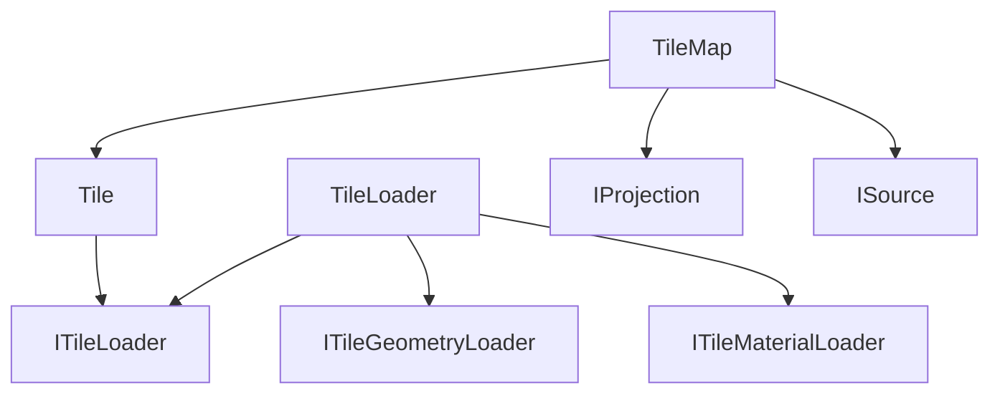

# Three-Tile 项目架构总览

## 项目简介

Three-Tile 是一个基于 Three.js 的瓦片地图渲染库，支持大规模地理数据的可视化。该项目实现了动态 LOD（Level of Detail）瓦片渲染，支持影像数据和地形数据的加载与渲染。

## 目录结构

```
packages/
├── lib/           # 核心库
│   ├── tile/      # 瓦片核心模块
│   ├── map/       # 地图管理模块
│   ├── geometry/  # 地形几何模块
│   ├── loader/    # 加载器模块
│   ├── material/  # 材质系统模块
│   └── source/    # 数据源模块
├── plugin/        # 插件扩展
└── demo/          # 示例代码
```

## 核心架构

### 1. 分层架构

```
┌─────────────────────────────────────────────────────┐
│                    TileMap (地图层)                   │
│  - 地图管理、投影转换、坐标变换                        │
└─────────────────────────────────────────────────────┘
                          │
┌─────────────────────────────────────────────────────┐
│                     Tile (瓦片层)                     │
│  - LOD管理、瓦片树、视锥体裁剪                         │
└─────────────────────────────────────────────────────┘
                          │
┌─────────────────────────────────────────────────────┐
│                   TileLoader (加载层)                 │
│  - 几何体加载、材质加载、数据管理                       │
└─────────────────────────────────────────────────────┘
                          │
┌──────────────────┬──────────────────┬───────────────┐
│  GeometryLoader  │ MaterialLoader   │   Source      │
│  (地形加载)       │  (影像加载)       │  (数据源)      │
└──────────────────┴──────────────────┴───────────────┘
```

### 2. 模块说明

| 模块 | 功能 | 核心类 |
|------|------|--------|
| **tile** | 瓦片核心逻辑，LOD管理 | `Tile`, `ITileLoader`, `FrustumEx` |
| **map** | 地图管理，投影转换 | `TileMap`, `TileMapLoader`, `IProjection` |
| **geometry** | 地形几何生成 | `TileGeometry`, `Martini` |
| **loader** | 数据加载管理 | `TileLoader`, `LoaderFactory` |
| **material** | 材质系统 | `TileMaterial`, `TileShaderMaterial` |
| **source** | 数据源定义 | `TileSource`, `ISource` |

### 3. 数据流向

```
用户请求
    │
    ▼
┌─────────────┐
│  TileMap    │ 创建地图
└─────────────┘
    │
    ▼
┌─────────────┐
│   Tile      │ 每帧更新，LOD评估
└─────────────┘
    │
    ▼ 需要加载数据
┌─────────────────────┐
│   TileLoader        │ 分发加载请求
└─────────────────────┘
    │           │
    ▼           ▼
┌──────────┐ ┌──────────┐
│ Geometry │ │ Material │
│  Loader  │ │  Loader  │
└──────────┘ └──────────┘
    │           │
    ▼           ▼
┌─────────────────────┐
│    TileSource       │ 生成URL
└─────────────────────┘
    │
    ▼
网络请求 → 解析数据 → 创建 Mesh → 添加到场景
```

### 4. LOD (Level of Detail) 系统

Three-Tile 实现了基于四叉树的动态 LOD 系统：

1. **四叉树结构**：每个瓦片可以细分为 4 个子瓦片（EPSG:4326 的 0 级除外）
2. **LOD 评估**：根据相机距离和瓦片大小动态决定是否细化/合并
3. **视锥体裁剪**：只处理视锥体内的瓦片
4. **异步加载**：支持并发控制（最大10个线程）

```typescript
// LOD 评估逻辑
if (tile.inFrustum && distRatio < threshold) {
    // 创建子瓦片（细化）
} else if (distRatio > threshold) {
    // 移除子瓦片（合并）
}
```

### 5. 投影系统

支持两种主流地图投影：

| 投影 | ID | 特点 |
|------|----|----|
| Web Mercator | 3857 | 墨卡托投影，Google/OSM标准 |
| WGS84 | 4326 | 经纬度线性投影 |

支持中央经线调整（-90°, 0°, 90°），解决跨日期问题。

## 技术特点

1. **高性能渲染**：基于四叉树的动态LOD，按需加载
2. **地形渲染**：集成 Martini 算法实现高效地形简化
3. **多数据源**：支持多个影像层叠加
4. **可扩展**：插件化加载器，支持自定义数据源
5. **Three.js 集成**：完全兼容 Three.js 生态系统

## 依赖关系


